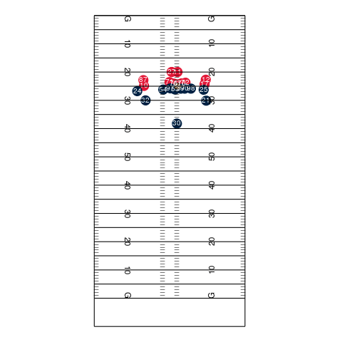

# Identifying Best Receiver-Route Combinations

### Important Files
- db.Rmd: 1st markdown file working to define different receiver routes, and simulate NFL plays
- routes.R: contains all route definition fns which we will later import

### Todo
- [ ] Finish defining 9 core receiver routes
- [ ] Gather gen stats on common combos, successful plays
- [ ] Potentially work to add in defensive schemes, and timing in-game.

### Add Remote Repo to your computer
```
mkdir data_bowl
cd data_bowlext install DavidAnson.vscode-markdownlint
git init
git remote add origin <url>
git pull origin master
```

### Adding your edits
```
git pull
git add -A
git status
git commit -m '<message>'
git push
```
** if it is your first time pushing to github.com, please use
```
git push -u origin master
```

# Check out our play simulation function!

